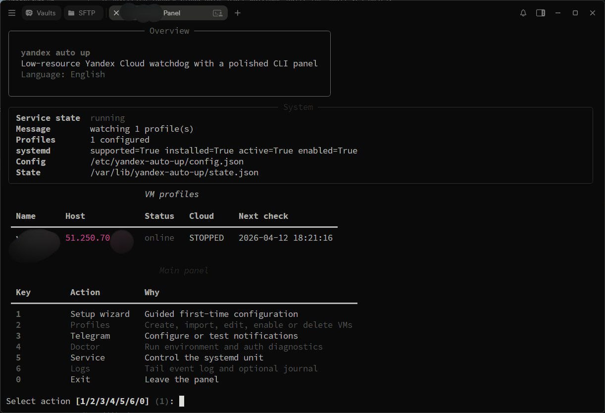

<div align="center">

# yandex-auto-up by censorny

Low-resource Yandex Cloud watchdog for small VPS hosts with a polished CLI panel, systemd-native runtime, and zero Docker requirement in production.

[Русская версия](README.md) · [Screenshot](#screenshot) · [Install](#quick-start) · [Uninstall](#uninstall) · [Support](#support)


</div>

## What It Is

`yandex-auto-up` is designed to live on a VPS, start itself after reboot, monitor selected Yandex Cloud VMs, and issue a cloud start operation when a stopped instance must come back online.

> [!IMPORTANT]
> This project can start billable cloud resources. Before using it in production, verify quotas, pricing, IAM permissions, and cleanup expectations in Yandex Cloud.

> [!TIP]
> Run `yauto doctor` right after the first setup to validate the key, the systemd unit, and the health-check pipeline.

The project is intentionally narrow and operationally boring:

- one daemon process under `systemd`
- one CLI entrypoint for setup and daily control
- one local config/state layout
- Service Account auth instead of fragile browser-driven flows

<a id="screenshot"></a>

## 📸 Screenshot



## ✨ Features

- Auto-starts with the VPS through `systemd`.
- Checks each VM with lightweight reachability probes.
- Knows both the network status and the cloud status.
- Starts instances through Yandex Cloud when they are stopped.
- Avoids hammering the cloud API when an instance is already running but the network is degraded.
- Stores profiles, runtime state, and events locally.
- Opens a polished CLI panel with setup, profile, Telegram, service, and uninstall actions.
- Reads version and branding from `version.json`.
- Shows a subtle GitHub update note when a newer release is available.

## 🧠 Why This Shape

The original bash + Docker approach was useful as inspiration, but for a tiny long-lived watchdog it created too much operational surface. This implementation keeps the stack smaller:

- `systemd` handles process lifecycle.
- the Python daemon handles monitoring and start requests.
- the CLI handles onboarding, diagnostics, and maintenance.
- state is persisted on disk instead of being kept in growing in-memory structures.

<a id="quick-start"></a>

## 🚀 Quick Start

```bash
git clone https://github.com/censorny/yandex-auto-up.git
cd yandex-auto-up
sudo bash scripts/install.sh
sudo yauto
```

Recommended first-run flow:

1. Choose `1` for Russian or `2` for English.
2. Open `Setup wizard`.
3. Copy one or more service account key files into `/etc/yandex-auto-up/keys/`.
4. Import VMs from Yandex Cloud or create a profile manually.
5. Confirm the service state with `yauto status`.

The `keys/` directory is created automatically with a helper file. All files in that folder are checked by **content** (not extension) — any filename and any count works.

> [!TIP]
> If no clouds are visible for a Service Account, it is not always an auth failure. The role may be granted only on a specific folder. The updated panel now offers manual `Folder ID` input, and `yauto doctor` points this out explicitly.

> [!NOTE]
> If the service is already installed and you are only updating the code, you usually do not need to re-run the wizard. `yauto status`, `yauto doctor`, and the `Service panel` are enough.

## 🕹️ Commands

```bash
yauto
yauto setup
yauto status
yauto doctor
yauto logs --journal
yauto vm panel
yauto telegram panel
yauto service panel
yauto uninstall
```

Running `yauto` with no arguments asks for the UI language first, then opens the main panel.

## 🗂️ Server Layout

The installer creates and uses:

- `/opt/yandex-auto-up/app` for application code
- `/opt/yandex-auto-up/venv` for the dedicated Python environment
- `/etc/yandex-auto-up` for config and profiles
- `/etc/yandex-auto-up/keys` for Service Account key files
- `/etc/yandex-auto-up/profiles` for VM profile JSON files
- `/var/lib/yandex-auto-up` for runtime state and event logs
- `/usr/local/bin/yauto` as the CLI entrypoint
- `/etc/systemd/system/yandex-auto-up.service` as the service unit

## 🔄 Update Flow

Updating is intentionally the same as installing:

```bash
git pull
sudo bash scripts/install.sh
sudo systemctl status yandex-auto-up
```

If GitHub has a newer version, the panel shows a quiet green note near the header. The check is cached locally and does not spam the network on every launch.

<a id="uninstall"></a>

## 🧹 Uninstall

Two options are available:

1. Use the `Service panel` inside `yauto`.
2. Run the command directly:

```bash
sudo yauto uninstall
```

The uninstall script stops the service, disables it, removes the CLI symlink, removes the unit file, deletes runtime/config directories, and also cleans the staging directory if it exists.

## 📈 Scaling

There is no hardcoded VM count limit in the code. The real limit depends on:

- your check interval
- Yandex Cloud API quotas
- the CPU and memory budget of the VPS itself

For a few servers or a few dozen profiles, a single daemon is enough. Beyond that, you should plan intervals, sharding, or multiple watchdog nodes deliberately.

## 🛡️ Stability and Memory Model

The project is intentionally structured to avoid slow memory growth:

- the daemon does not keep an unbounded event list in RAM
- current state is stored as a single snapshot file
- event history is appended to disk
- update checks use a cached TTL-based file
- runtime stays small because there is no Docker layer and no extra worker farm

That is not a blanket promise against every bug, but there is no deliberate architecture here that should balloon memory over time.

> [!WARNING]
> If the chosen health host is wrong or blocked by a firewall, the service will honestly treat the VM as unavailable. In production, always verify the exact endpoint you expect to answer.

## 📣 Telegram

Telegram support is optional. If configured, it is used only for notifications. If you do not need it, the project runs normally without it.

## 🧪 Local Development

```bash
python -m venv .venv
. .venv/bin/activate
pip install -e .[dev]
pytest -q
```

## 🏗️ Project Layout

```text
yandex-auto-up/
  LICENSE
  README.md
  README.en.md
  assets/
    english_screenshot.jpg
    russian_screenshot.jpg
  scripts/
    install.sh
    uninstall.sh
  systemd/
    yandex-auto-up.service
  src/yauto/
    cli/
    cloud/
    config/
    daemon/
    notify/
    storage/
    version.json
  tests/
```

## 🔐 Security Notes

- Keep Service Account key files only in `/etc/yandex-auto-up/keys` on the VPS that runs the watchdog.
- Use strict permissions for key files, ideally `600`, and limit access to the containing directory.
- Do not commit secrets to the repository.
- Store Telegram token and chat id only in the local server config.

<a id="support"></a>

## 💖 Support the Project

USDT and compatible network addresses:

| Network | Address |
| --- | --- |
| TON | `UQAStmfLsz9c3yRA3SeADT5kKdKSUZIt0i6z6B0A6gT884wE` |
| TRC20 | `THCFoTpjGdaEkGvQe9V8A3WMdQMJ3fUhTq` |
| SPL | `E1Z978yBMJ3UA4y7xZwv57cBxEUoZ5i9TMsrhcxfVRV6` |
| ERC20 | `0xc6e0828F6aAF152E82fbEb9f7Abd39051208502F` |
| BEP20 | `0xc6e0828F6aAF152E82fbEb9f7Abd39051208502F` |

## 🙏 Inspiration

This project was inspired by [Mastachok/ya-vps-autostart](https://github.com/Mastachok/ya-vps-autostart/). `yandex-auto-up` is not a fork in terms of runtime architecture; it is a separate implementation built around a Python daemon and a systemd-first operating model.

## 📄 License

This project is distributed under the MIT License. See [LICENSE](LICENSE) for details.

<div align="center">

made with love for the community

</div>