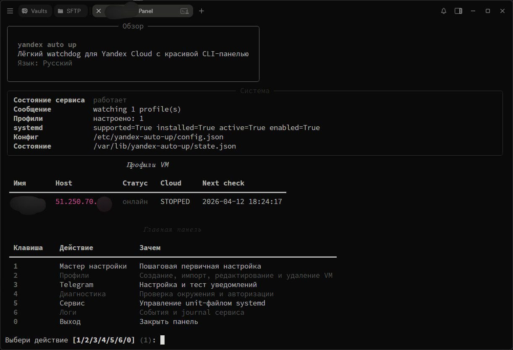

<div align="center">

# yandex-auto-up by censorny

Лёгкий watchdog для Yandex Cloud и Selectel, который живёт на VPS, сам поднимается после ребута и через красивую CLI-панель следит за вашими VM.

[English README](README.en.md) · [Скриншот](#screenshot) · [Установка](#quick-start) · [Удаление](#uninstall) · [Поддержать](#support)


</div>

## Что это

`yandex-auto-up` запускается на маленьком VPS и делает ровно одну работу: следит за выбранными VM в Yandex Cloud и Selectel и поднимает их, когда они должны быть онлайн. Без Docker в рантайме, без тяжёлой TUI, без разрастания фоновых процессов.

> [!IMPORTANT]
> Проект может запускать платные облачные VM в Yandex Cloud и Selectel. Перед боевым использованием проверьте квоты, стоимость, IAM-права и лимиты облачных провайдеров.

> [!TIP]
> После первой настройки сразу прогоните `yauto doctor`, чтобы проверить ключ, systemd и текущий health pipeline.

Проект сделан для сценария, где нужен максимально спокойный и предсказуемый watchdog:

- один daemon-процесс под `systemd`
- быстрый старт после перезагрузки VPS
- понятная CLI-панель с выбором действий
- Service Account авторизация без ручного OAuth-цирка
- локальное хранение состояния, профилей и событий

<a id="screenshot"></a>

## 📸 Скриншот



## ✨ Что умеет

- Поддерживает Yandex Cloud и Selectel Cloud.
- Поднимается сам после ребута VPS через `systemd`.
- Проверяет доступность каждой VM по сети и знает её cloud state.
- Отправляет команду запуска в облако, если инстанс остановлен.
- Не долбит API без остановки, если VM уже работает, но сеть деградировала.
- Держит одну интерактивную CLI-панель с меню для настройки, профилей, Telegram, сервиса и удаления.
- Показывает язык, версию из `version.json` и ненавязчивое уведомление о новой версии с GitHub.
- Позволяет импортировать VM из облака или создать профиль вручную.
- Пишет события в локальный лог и хранит текущее состояние отдельно.

## 🧠 Почему так

Старый стек на bash + Docker решал задачу, но для долгоживущего маленького watchdog это было слишком тяжело по сопровождению. В этой версии сделан упор на более жёсткую эксплуатационную модель:

- `systemd` отвечает за автозапуск и перезапуск.
- Python-daemon отвечает только за мониторинг и start operations.
- CLI отвечает только за управление, диагностику и onboarding.
- Конфиг и состояние лежат в отдельных каталогах, чтобы обновление и удаление были предсказуемыми.

<a id="quick-start"></a>

## 🚀 Быстрый старт

Минимальный сценарий для нового сервера:

```bash
git clone https://github.com/censorny/yandex-auto-up.git
cd yandex-auto-up
sudo bash scripts/install.sh
sudo yauto
```

После этого:

1. Выберите язык: `1` для русского или `2` для английского.
2. Откройте `Setup wizard`.
3. Для Yandex Cloud: скопируйте один или несколько файлов ключей в `/etc/yandex-auto-up/keys/`.
4. Для Selectel: создайте файл `/etc/yandex-auto-up/selectel-credentials.json` с учетными данными:
   ```json
   {
     "username": "your_service_user",
     "password": "your_password",
     "account_id": "your_account_id",
     "project_id": "your_project_id"
   }
   ```
5. Импортируйте VM из облака или создайте профиль вручную.
6. Проверьте статус через `yauto status`.

Каталог `keys/` создаётся автоматически с файлом-подсказкой для Yandex Cloud. Все файлы в этой папке проверяются по **содержимому** (не по расширению) — любое имя файла и любое количество.

Для Selectel используется отдельный файл с учетными данными сервисного пользователя.

> [!TIP]
> Если для Service Account не видно ни одного облака, это не всегда ошибка: права могли быть выданы только на конкретный каталог. В новой версии панель предложит ввести `Folder ID` вручную, а `yauto doctor` подскажет, что именно происходит.

> [!NOTE]
> Если сервис уже был установлен и вы просто обновили код, мастер можно не запускать заново: достаточно `yauto status`, `yauto doctor` и при необходимости открыть `Service panel`.

## 🕹️ Команды

```bash
yauto
yauto setup
yauto status
yauto doctor
yauto logs --journal
yauto vm panel
yauto telegram panel
yauto service panel
yauto uninstall
```

При запуске без аргументов `yauto` сначала спрашивает язык, потом открывает главную панель.

## 🗂️ Структура на сервере

Установщик создаёт и использует следующие точки:

- `/opt/yandex-auto-up/app` — код приложения
- `/opt/yandex-auto-up/venv` — отдельное Python-окружение
- `/etc/yandex-auto-up` — конфиг и профили
- `/etc/yandex-auto-up/keys` — каталог с ключами Service Account
- `/etc/yandex-auto-up/profiles` — JSON-профили VM
- `/var/lib/yandex-auto-up` — state и event log
- `/usr/local/bin/yauto` — CLI entrypoint
- `/etc/systemd/system/yandex-auto-up.service` — systemd unit

## 🔄 Обновление

Обновление намеренно такое же простое, как первая установка:

```bash
git pull
sudo bash scripts/install.sh
sudo systemctl status yandex-auto-up
```

Если на GitHub есть более свежая версия, панель аккуратно покажет это в верхней части экрана. Проверка кэшируется локально и не превращается в шум при каждом запуске.

<a id="uninstall"></a>

## 🧹 Удаление

Есть два пути:

1. Через `Service panel` внутри `yauto`.
2. Напрямую командой:

```bash
sudo yauto uninstall
```

Скрипт удаления:

- останавливает и отключает `yandex-auto-up.service`
- удаляет бинарную ссылку `yauto`
- удаляет systemd unit
- удаляет каталоги `/opt/yandex-auto-up`, `/etc/yandex-auto-up`, `/var/lib/yandex-auto-up`, `/run/yandex-auto-up`
- убирает временный staging-каталог `/root/yandex-auto-up`, если он остался

## 📈 Масштабирование

Жёсткого лимита на количество VM в коде нет. Практический предел упирается в три вещи:

- интервал проверки
- квоты Yandex Cloud API
- ресурсы самого VPS

Для нескольких серверов и десятков профилей одной службы достаточно. Для больших парков разумно уже планировать интервалы, шардирование или отдельные watchdog-нодсы.

## 🛡️ Стабильность и память

Проект специально собран так, чтобы не течь по памяти при долгой работе:

- daemon не копит бесконечные списки событий в RAM
- текущее состояние хранится одним snapshot-файлом
- история событий пишется append-only в файл на диске
- update-check использует кэш с TTL, а не постоянные сетевые запросы
- нет Docker runtime и пачки лишних фоновых процессов

Это не магическая гарантия против любого бага, но архитектурно здесь нет механики, которая должна раздувать память от недели к неделе.

> [!WARNING]
> Если health host выбран неправильно или заблокирован firewall-ом, сервис будет честно считать VM недоступной. На проде всегда проверяйте именно тот адрес, который реально должен отвечать.

## 📣 Telegram

Telegram полностью опционален. Если он нужен, бот настраивается из панели и используется только для уведомлений. Если не нужен, проект спокойно работает без него.

## 🧪 Локальная разработка

```bash
python -m venv .venv
. .venv/bin/activate
pip install -e .[dev]
pytest -q
```

## 🏗️ Устройство проекта

```text
yandex-auto-up/
  LICENSE
  README.md
  README.en.md
  assets/
    english_screenshot.jpg
    russian_screenshot.jpg
  scripts/
    install.sh
    uninstall.sh
  systemd/
    yandex-auto-up.service
  src/yauto/
    cli/
    cloud/
    config/
    daemon/
    notify/
    storage/
    version.json
  tests/
```

## 🔐 Безопасность

- Храните ключи только в `/etc/yandex-auto-up/keys` на VPS, где реально работает watchdog.
- Для ключей стоит использовать строгие права доступа, например `600` на файлы и ограниченный доступ к директории.
- Не держите секреты в git-репозитории.
- Telegram token и chat id должны храниться только в локальном конфиге сервера.

<a id="support"></a>

## 💖 Поддержать проект

Приём USDT и совместимых сетей:

| Сеть | Адрес |
| --- | --- |
| TON | `UQAStmfLsz9c3yRA3SeADT5kKdKSUZIt0i6z6B0A6gT884wE` |
| TRC20 | `THCFoTpjGdaEkGvQe9V8A3WMdQMJ3fUhTq` |
| SPL | `E1Z978yBMJ3UA4y7xZwv57cBxEUoZ5i9TMsrhcxfVRV6` |
| ERC20 | `0xc6e0828F6aAF152E82fbEb9f7Abd39051208502F` |
| BEP20 | `0xc6e0828F6aAF152E82fbEb9f7Abd39051208502F` |

## 🙏 Источник вдохновения

Идея выросла из проекта [Mastachok/ya-vps-autostart](https://github.com/Mastachok/ya-vps-autostart/). `yandex-auto-up` не является его форком по архитектуре: это отдельная реализация с другим runtime-подходом, но с явным уважением к исходной идее.

## 📄 Лицензия

Проект распространяется по MIT License. Подробности в файле [LICENSE](LICENSE).

<div align="center">

сделано с любовью к комьюнити

</div>
